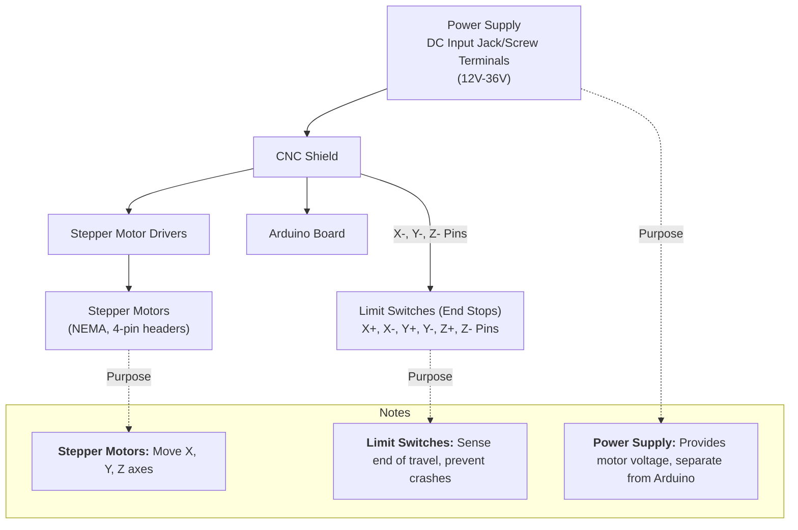

# CNCjs and Arduino Nano Shield V3 Setup Guide

This guide provides step-by-step instructions to set up CNCjs with an Arduino Nano Shield V3, including downloading the required software and uploading GRBL firmware for CNC milling.

---

## Table of Contents
1. [Overview](#overview)
2. [Download CNCjs](#download-cncjs)
3. [Uploading GRBL to Arduino Nano Shield V3](#uploading-grbl-to-arduino-nano-shield-v3)
4. [Connecting to CNCjs](#connecting-to-cncjs)
5. [Resources](#resources)

---

## 📢 Support the UniversalBit Project
Help us grow and continue innovating!  
- [Support the UniversalBit Project](https://github.com/universalbit-dev/universalbit-dev/tree/main/support) 
- [Learn about Disambiguation](https://en.wikipedia.org/wiki/Wikipedia:Disambiguation)  
- [Bash Reference Manual](https://www.gnu.org/software/bash/manual/)
---

## Overview

**CNCjs** is a full-featured, web-based interface for CNC controllers running Grbl, Marlin, Smoothieware, or TinyG. It enables users to upload G-code and simulate CNC milling operations efficiently.


---


## Download CNCjs

To download the CNCjs Linux app image:

### Using `wget`
Run the following command to download CNCjs version 1.10.3:
```bash
wget https://github.com/cncjs/cncjs/releases/download/v1.10.3/cncjs-app-1.10.3-linux-x86_64.AppImage
```

### Direct Download
[CNCjs Desktop App v1.10.3](https://github.com/cncjs/cncjs/releases/download/v1.10.3/cncjs-app-1.10.3-linux-x86_64.AppImage)

For additional versions, visit the [CNCjs Releases Page](https://github.com/cncjs/cncjs/releases).

---

## Uploading GRBL to Arduino Nano Shield V3

**GRBL** is a high-performance firmware for CNC milling. Below are the steps to upload GRBL to an Arduino Nano Shield V3.

### Prerequisites
Ensure your system has the following packages installed:
```bash
sudo apt install arduino zip unzip wget
```

### Download GRBL
Download and extract GRBL version 1.1:
```bash
cd ~/Downloads
wget https://github.com/gnea/grbl/archive/refs/tags/v1.1h.20190825.zip
unzip grbl-1.1h.20190825.zip
cd grbl-1.1h.20190825/
zip -r grbl.zip grbl
```

### Prepare GRBL for Arduino IDE
1. Rename the folder:
    ```bash
    cp -R ~/Downloads/grbl-1.1h.20190825 GRBL
    ```
2. Copy the GRBL folder to the Arduino Libraries directory:
    ```bash
    cp -R GRBL /home/<your-username>/Arduino/libraries/
    ```

### Upload GRBL Firmware
1. Download and install the [Arduino IDE](https://www.arduino.cc/en/software) (Version 1.8.19 recommended).
2. Run the Arduino IDE.
3. Navigate to **Sketch → Include Library → Add .ZIP Library**, and select the `grbl.zip` file created earlier.
4. Upload the firmware to your Arduino Nano Shield V3.

---

## Connecting to CNCjs

Once GRBL is uploaded, connect your Arduino Nano Shield V3 to CNCjs. This allows you to upload G-code and start CNC milling simulations.

For more details, visit the [CNC Router Machines Repository](https://github.com/universalbit-dev/cnc-router-machines).

---

## Resources

Explore the following resources for additional information and tools:

- [CNC Machines](https://github.com/universalbit-dev/cnc-router-machines)
- [CNC Wiki](https://en.wikipedia.org/wiki/CNC_router)
- [Universal G-Code Sender (UGS)](https://universalgcodesender.com/)

---
