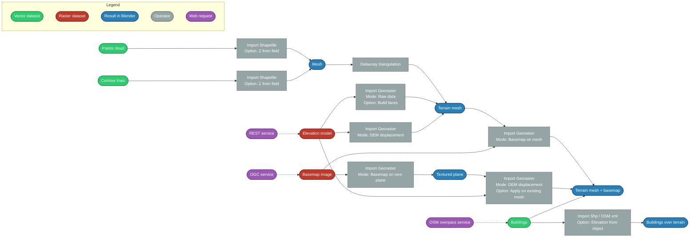

```mermaid
flowchart LR
  PC(["Points cloud"]):::vector
  CL(["Contour lines"]):::vector
  PC --> IS1["Import Shapefile<br/>Option: Z from field"]:::operator
  CL --> IS2["Import Shapefile<br/>Option: Z from field"]:::operator
  IS1 --> Mesh(["Mesh"]):::result
  IS2 --> Mesh

  Mesh --> DT["Delaunay triangulation"]:::operator
  DT --> TerrainMesh(["Terrain mesh"]):::result

  ElevModel(["Elevation model"]):::raster
  ElevModel --> IG_Raw["Import Georaster<br/>Mode: Raw data<br/>Option: Build faces"]:::operator
  ElevModel --> IG_DEMdisp["Import Georaster<br/>Mode: DEM displacement"]:::operator
  IG_Raw --> TerrainMesh
  IG_DEMdisp --> TerrainMesh

  Basemap(["Basemap image"]):::raster
  Basemap --> IG_plane["Import Georaster<br/>Mode: Basemap on new plane"]:::operator
  IG_plane --> TexturedPlane(["Textured plane"]):::result

  TerrainMesh --> IG_basemap_on_mesh["Import Georaster<br/>Mode: Basemap on mesh"]:::operator
  Basemap --> IG_basemap_on_mesh
  IG_basemap_on_mesh --> TerrainWithBasemap(["Terrain mesh + basemap"]):::result

  TexturedPlane --> IG_apply_dem["Import Georaster<br/>Mode: DEM displacement<br/>Option: Apply on existing mesh"]:::operator
  ElevModel --> IG_apply_dem
  IG_apply_dem --> TerrainWithBasemap

  OSMsvc(["OSM overpass service"]):::web
  OSMsvc -.-> BuildingsData(["Buildings"]):::vector
  BuildingsData --> IS_shp_osm["Import Shp / OSM xml<br/>Option: Elevation from object"]:::operator
  IS_shp_osm --> BuildingsOverTerrain(["Buildings over terrain"]):::result
  BuildingsData --> TerrainWithBasemap

  RESTsvc(["REST service"]):::web
  OGCsvc(["OGC service"]):::web
  RESTsvc -.-> ElevModel
  OGCsvc -.-> Basemap

  subgraph LEGEND["Legend"]
    direction TB
    L_vec(["Vector dataset"]):::vector
    L_ras(["Raster dataset"]):::raster
    L_res(["Result in Blender"]):::result
    L_op(["Operator"]):::operator
    L_web(["Web request"]):::web
  end

  classDef vector fill:#2ecc71,stroke:#1a7a33,color:#fff;
  classDef raster fill:#c0392b,stroke:#7a1f17,color:#fff;
  classDef result fill:#2980b9,stroke:#123f5a,color:#fff;
  classDef operator fill:#95a5a6,stroke:#6b6b6b,color:#fff;
  classDef web fill:#9b59b6,stroke:#6e247b,color:#fff;
```
