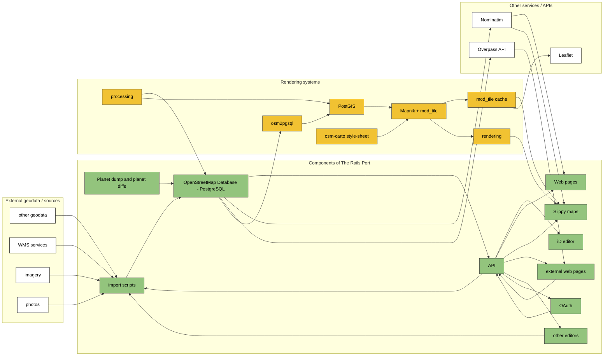

```mermaid
flowchart LR
  %% External data sources
  subgraph ExternalData["External geodata / sources"]
    direction LR
    OG[other geodata]
    WMS[WMS services]
    IMG[imagery]
    PH[photos]
  end

  %% Rails Port / core OSM components (green)
  subgraph RailsPort["Components of The Rails Port"]
    direction TB
    PL[Planet dump and planet diffs]
    DB[OpenStreetMap Database - PostgreSQL]
    API[API]
    OAuth[OAuth]
    ID[iD editor]
    WP[Web pages]
    SM[Slippy maps]
    Import[import scripts]
    Editors[other editors]
    ExtWeb[external web pages]
  end

  %% Rendering system components (yellow)
  subgraph RenderSys["Rendering systems"]
    direction TB
    Osm2Pg[osm2pgsql]
    PostGIS[PostGIS]
    Style[osm-carto style-sheet]
    Mapnik[Mapnik + mod_tile]
    ModCache[mod_tile cache]
    Rendering[rendering]
    Processing[processing]
  end

  %% Other services/tools (white)
  subgraph Services["Other services / APIs"]
    direction TB
    Nominatim[Nominatim]
    Overpass[Overpass API]
    Leaflet[Leaflet]
  end

  %% Data / control flows
  PL --> DB
  DB --> API
  API --> ID
  API --> WP
  API --> SM
  API --> ExtWeb
  API --> Import
  API --> Editors
  API --> OAuth
  OAuth --> API

  DB --> Nominatim
  DB --> Overpass

  DB --> Osm2Pg
  Osm2Pg --> PostGIS
  PostGIS --> Mapnik
  Style --> Mapnik
  Mapnik --> ModCache
  ModCache --> SM
  ModCache --> Leaflet
  Mapnik --> Rendering
  Rendering --> SM

  Nominatim --> WP
  Nominatim --> SM
  Overpass --> ExtWeb

  %% External data ingestion
  OG --> Import
  WMS --> Import
  IMG --> Import
  PH --> Import

  %% Editors and imports
  Editors --> Import
  Import --> DB
  ExtWeb --> API

  %% Processing relations
  Processing --> DB
  Processing --> PostGIS

  %% Styling classes
  class DB,PL,API,OAuth,ID,WP,SM,Import,Editors,ExtWeb rails
  class Osm2Pg,PostGIS,Mapnik,ModCache,Style,Rendering,Processing render
  class OG,WMS,IMG,PH,Nominatim,Overpass,Leaflet other

  classDef rails fill:#93c47d,stroke:#333,stroke-width:1px,color:#000
  classDef render fill:#f1c232,stroke:#333,stroke-width:1px,color:#000
  classDef other fill:#ffffff,stroke:#000,stroke-width:1px,color:#000
```
