# UniversalBit Dev Repository

## Overview
The **UniversalBit Dev** repository is a collection of innovative projects exploring cutting-edge technologies. From IoT applications to artificial intelligence, blockchain, and sustainable personal finance models, this repository embodies modularity, scalability, and open-source collaboration.

```mermaid
flowchart TD
    %% Thin Client Cluster
    subgraph Cluster["Thin Client Cluster"]
        unbt01["1️⃣ unbt01\nCityGenerator"]
        unbt02["2️⃣ unbt02\nCNCjs"]
        unbt03["3️⃣ unbt03\ngekko-m4"]
        unbt04["4️⃣ unbt04\nESP8266 NTP/Dev"]
    end

    %% Infrastructure Nodes
    subgraph Infra["Infrastructure"]
        unbt05["5️⃣ unbt05\nIPFire (DMZ Firewall)"]
        unbt06["6️⃣ unbt06\nPi-hole (DNS Filter)"]
        Switch["7️⃣ Gigabit Switch"]
        Router["8️⃣ ISP Router (DMZ: unbt05)"]
        Internet["9️⃣ Internet"]
    end

    %% Specialized Services
    subgraph Services["Specialized"]
        ANN["🔟 ANN\nArduino/ESP32"]
        Blockchain["1️⃣1️⃣ Blockchain\nMapping"]
    end

    %% Physical connections
    unbt01 -- Ethernet --> Switch
    unbt02 -- Ethernet --> Switch
    unbt03 -- Ethernet --> Switch
    unbt04 -- Ethernet --> Switch
    unbt05 -- Ethernet --> Switch
    unbt06 -- Ethernet --> Switch
    Switch -- Ethernet --> Router
    Router -- WAN --> Internet

    %% DMZ and DNS Roles
    Router -- DMZ --> unbt05
    unbt05 -- Firewall --> Switch
    unbt06 -- DNS --> Router

    %% Cluster communication (logical mesh)
    unbt01 -. Cluster Link .-> unbt02
    unbt02 -. Cluster Link .-> unbt03
    unbt03 -. Cluster Link .-> unbt04
    unbt04 -. Cluster Link .-> unbt01

    %% Specialized service connections
    unbt04 -- NTP/IoT --> ANN
    unbt03 -- Finance/AI --> Blockchain
    unbt01 -- City Data --> Blockchain

    %% Monitoring & Filtering
    unbt05 -- Monitor --> unbt01
    unbt05 -- Monitor --> unbt02
    unbt05 -- Monitor --> unbt03
    unbt05 -- Monitor --> unbt04
    unbt06 -- Filter --> unbt01
    unbt06 -- Filter --> unbt02
    unbt06 -- Filter --> unbt03
    unbt06 -- Filter --> unbt04

    %% Resource Links (tooltips for easy navigation)
    click unbt01 "https://github.com/universalbit-dev/CityGenerator" "CityGenerator Repo"
    click unbt02 "https://github.com/universalbit-dev/cnc-router-machines" "CNC Router Machines Repo"
    click unbt03 "https://github.com/universalbit-dev/gekko-m4-globular-cluster" "gekko-m4 Repo"
    click unbt04 "https://github.com/universalbit-dev/HArmadillium" "HArmadillium Repo"
    click ANN "https://github.com/universalbit-dev/HArmadillium" "Arduino/ESP32 ANN"
    click Blockchain "https://github.com/universalbit-dev/gekko-m4-globular-cluster" "Blockchain Mapping Tools"
```




---

## Table of Contents
1. [Overview](#overview)
2. [Repository Structure](#repository-structure)
3. [Software Architecture Patterns](#software-architecture-patterns)
4. [Key Projects](#key-projects)
5. [Disambiguation](#disambiguation)
6. [Support UniversalBit](#support-universalbit)
7. [Getting Started](#getting-started)
8. [Contributing](#contributing)
9. [Resources](#resources)

---

## Repository Structure
This repository is organized into multiple sub-projects, each focusing on a specific domain or technology:
- **ESP8266**: A Wi-Fi microchip-based NTP server for IoT applications.
- **ANN**: Implementation of artificial neural networks for Arduino and ESP32 platforms.
- **Blockchain**: Bitcoin infrastructure and live network mapping tools.
- **CNC**: Desktop AppImage for CNC milling machines and 3D printers.
- **HA Cluster**: High Availability clusters for IT resource management.
- **Gekko M4 Globular Cluster Cryptocurrency**: Sustainable personal finance modeling.
- Explore additional projects like **CityGenerator**, **CDN JsDelivr**, and more.

---

## Software Architecture Patterns
This repository adopts various software architecture patterns to enhance modularity, scalability, and maintainability. Some notable patterns include:
1. **Layered Architecture**:
   - Projects like **ANN** and **ESP8266** utilize layered designs, separating hardware interfacing, communication protocols, and logic layers.
2. **Event-Driven Architecture**:
   - The **Blockchain** and **Gekko M4** sub-projects utilize event-driven principles to react to real-time data changes.
3. **Microservices and Modular Design**:
   - Projects such as **HA Cluster** and **CNCjs** are designed to function as independent modules, making them reusable and flexible.
4. **Client-Server Architecture**:
   - IoT-related projects like **ESP8266 NTP Server** implement client-server communication models.

---

## Key Projects

### [HA Cluster](https://github.com/universalbit-dev/HArmadillium/blob/main/readme.md)
**Description**:  
The **HA Cluster Project** focuses on deploying **High Availability (HA)** Clusters effectively to ensure continuous availability of critical IT resources and services.

**Key Features**:
- **High Availability**: Reduces downtime by creating resilient server clusters to handle failures seamlessly.
- **Scalable Architecture**: Designed to scale with growing infrastructure needs.
- **Fault Tolerance**: Implements redundancy to protect against hardware and software failures.
- **Learning Journey**: Comprehensive documentation and resources to help others understand and deploy HA clusters.

**Getting Started**:
1. Clone the repository for the HA Cluster project:
   ```bash
   git clone https://github.com/universalbit-dev/HArmadillium.git
   cd HArmadillium
   ```
2. Follow the [documentation](https://github.com/universalbit-dev/HArmadillium/blob/main/readme.md) to set up your HA Cluster environment.

**Use Cases**:
- **Enterprise IT**: Ensure uninterrupted access to mission-critical applications.
- **Web Hosting**: Maintain availability for websites and services during server failures.
- **Database Clustering**: High availability for databases with automatic failover.

---

### [Gekko M4 Globular Cluster Cryptocurrency](https://github.com/universalbit-dev/gekko-m4)
**Description**:  
The **Gekko M4 Globular Cluster Cryptocurrency** project introduces a sustainable approach to personal finance and cryptocurrency modeling. It explores innovative financial systems inspired by decentralized technologies and ecological sustainability.

**Key Features**:
1. **Decentralized Finance (DeFi)**: Leverages blockchain principles to create secure, decentralized financial models.
2. **Sustainability Focus**: Prioritizes environmentally conscious solutions for cryptocurrency systems.
3. **Globular Cluster Design**: Implements a unique tokenomics model inspired by the structure of globular clusters in astronomy.
4. **Personal Finance**: Provides tools for individuals to manage and grow their financial resources sustainably.

**Getting Started**:
1. Clone the repository:
   ```bash
   git clone https://github.com/universalbit-dev/gekko-m4.git
   cd gekko-m4
   ```
2. Explore the documentation and use case examples to understand the financial models and tools provided.

**Use Cases**:
- **Cryptocurrency Research**: Study unique tokenomics inspired by natural systems.
- **Personal Finance Management**: Tools to enhance financial literacy and sustainable investment.
- **Sustainable Blockchain Development**: Models for building energy-efficient blockchain systems.

---

### [ESP8266 NTP Server](ESP8266/readme.md)
**Purpose**: Synchronize devices' time using the ESP8266 microcontroller and Network Time Protocol (NTP).  
**Features**:
- Simple and cost-effective IoT time synchronization.
- Compatible with D1 Mini ESP8266 boards.

---

### [Artificial Neural Network (ANN)](ann/readme.md)
**Purpose**: Implement feedforward neural networks on Arduino and ESP32 microcontrollers.  
**Features**:
- Learn and predict based on input-output patterns.
- Supports multiple platforms, including Arduino Nano and ESP8266.

---

### [Blockchain Infrastructure](https://github.com/universalbit-dev/universalbit-dev/tree/main/blockchain/bitcoin)
**Purpose**: Explore blockchain technology with tools for Bitcoin network mapping.  
**Features**:
- Live network and blockchain node visualization.
- Tools for studying distributed systems.

---

### [CityGenerator](https://github.com/universalbit-dev/CityGenerator)
**Purpose**: Generate dynamic urban models inspired by the "Fab City" framework.  
**Features**:
- Tools for simulating sustainable, self-sufficient cities.
- Modular design for adapting to diverse urban planning needs.

---

### [CNCjs Desktop AppImage](cnc/readme.md)
**Purpose**: Desktop application for managing CNC milling machines and 3D printers.  
**Features**:
- User-friendly interface for CNC operations.
- Cross-platform support with AppImage packaging.

---

## Disambiguation
The **UniversalBit Dev** repository covers a wide range of projects and technologies. If you encounter any confusion or need clarification about specific terms, sub-projects, or concepts, please refer to:
- [Disambiguation on Wikipedia](https://en.wikipedia.org/wiki/Wikipedia:Disambiguation)
- The documentation within each sub-project directory.

Feel free to open an issue or discussion in the repository for further clarification.

- **Advantages**

Efficient way to share large amounts of data
A subsystem does not have to worry about how data is produced or used by other subsystems.
Centralized management of backup, security, access control, and error recovery.
Easy to add new subsystems.

- **Disadvantages**

Systems must agree on a compromise data model, which could negatively impact performance.
Adopting a new data model becomes difficult and costly: the entire repository must be modified and all subsystems must be updated.
Centralizing backup and security does not address the specific requirements of certain subsystems.
It is difficult to efficiently distribute the repository across multiple separate machines while still viewing it as logically centralized. This would create redundancy and data consistency issues.

---

## Support UniversalBit
You can support the **UniversalBit** project by:
- **Donating**: Your contributions help us maintain and expand these open-source projects.  
  Donate directly using the options provided in the [Support UniversalBit](https://github.com/universalbit-dev/universalbit-dev/tree/main/support) section.
- **Sharing**: Spread the word about UniversalBit and its projects to help grow our community.
- **Contributing**: Submit code, ideas, or feedback through pull requests or discussions.

Thank you for helping us build and sustain innovative projects for the open-source community!

---

## Getting Started
### Clone the Repository
To get started, clone the repository and explore the sub-projects:
```bash
git clone https://github.com/universalbit-dev/universalbit-dev.git
```

---

## Contributing
We welcome contributions to enhance the UniversalBit Dev repository! Please follow these steps:
1. Fork the repository.
2. Create a new branch for your changes.
3. Submit a pull request with a detailed description of your contributions.

---

## Resources
- [FreeCodeCamp: Software Architecture Patterns](https://www.freecodecamp.org/news/an-introduction-to-software-architecture-patterns/)
- Documentation and guides for individual sub-projects are available in their respective directories.

---
